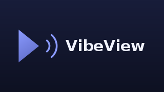

# VibeView

An Android TV app that turns your TV into an **AirPlay receiver**: full-screen
mirroring from iPhones, iPads, and Macs — with audio — plus AirPlay video
casting and photo sharing. It also acts as a **DLNA/UPnP renderer**, so Android
phones and other devices can cast media to it too.

<p align="center"></p>

## Features

- **Screen mirroring** — mirror the entire screen of an iPhone/iPad (Control
  Center → Screen Mirroring) or a Mac (Displays → Screen Mirroring), not just
  videos. Hardware H.264 decoding via MediaCodec.
- **Mirroring audio** — the audio accompanying mirroring is decoded and played
  in sync. AAC-ELD (mirroring's usual codec), AAC-LC, ALAC, and raw PCM are all
  handled; ALAC and Opus use the device's platform decoders where present.
- **Low latency** — the video decoder runs in MediaCodec low-latency mode with a
  small, drop-oldest frame backlog, and audio uses a low-latency AudioTrack, so
  the mirrored image tracks the source closely and recovers fast after network
  hiccups.
- **Video casting** — a sender that pushes a plain video URL (HLS or
  progressive) plays natively through ExoPlayer with play/pause/seek honored.
  This works over DLNA today; **AirPlay video casting from iOS does not yet
  work** — see limitations. Mirroring a video-playing app works fine.
- **Photo casting** — share a photo from the iOS Photos app and it appears on
  the TV.
- **DLNA / UPnP renderer** — VibeView advertises itself as a MediaRenderer, so
  Android apps with "Play to"/"Cast to TV" (plus VLC, Windows "Cast to device",
  Plex, and others) can push a video, photo, or music **URL** that plays through
  the same ExoPlayer path, with transport controls (play/pause/seek/volume),
  subtitles, a queued "next" track, and GENA events so the sender's UI follows
  playback live. This is media-URL casting, not live Android screen mirroring —
  see below.
- **AirPlay speaker mode** — an audio-only AirPlay session shows a now-playing
  screen with artwork, title/artist/album, and progress, parsed from the
  metadata iOS sends alongside the stream.
- **Diagnostics overlay** — an optional HUD (Advanced → Show diagnostics) with
  frame rates, bitrate, decoder latency, queue depth, and codec, for checking
  how a real session is behaving.
- **Optional passcode** — require a code, shown on the TV, before an Apple device
  can connect. Enforced with AirPlay's SRP-6a PIN pairing, so the code proves
  itself over the wire without ever being transmitted.
- **TV-friendly UI** — an idle screen with connection instructions, and a
  D-pad settings screen (device name, audio toggle, passcode, start-on-boot).
- Runs as a foreground service, so the TV stays discoverable while you use
  other apps, and (optionally) from boot.

## Requirements

- Android TV / Google TV device on Android 8.0 (API 26) or newer
- The TV and the Apple device on the same network (multicast/mDNS must not be
  blocked by the router — most home networks are fine)

## Install

**From CI:** every push runs the
[Build workflow](.github/workflows/build.yml), which assembles both flavors and
uploads them as the `vibeview-debug-apks` artifact. Download it from the
Actions run and sideload the one you want:

```sh
adb connect <tv-ip>
adb install app-production-debug.apk
```

**From source:** with an Android SDK installed (Android Studio, or
`ANDROID_HOME`/`ANDROID_SDK_ROOT` set):

```sh
./gradlew :app:assembleProductionDebug
adb connect <tv-ip>
adb install app/build/outputs/apk/production/debug/app-production-debug.apk
```

### Build variants

The app ships two flavors, differing only in the idle-screen subtitle:

| Flavor | Subtitle | Assemble |
|--------|----------|----------|
| `production` | "AirPlay screen mirroring receiver" | `:app:assembleProductionDebug` / `:app:assembleProductionRelease` |
| `home` | "Elad's AirPlay screen mirroring receiver" | `:app:assembleHomeDebug` / `:app:assembleHomeRelease` |

`home` builds carry a `-home` version-name suffix so the APKs are easy to tell
apart. `./gradlew :app:assembleDebug` builds both. Flavor-specific resources
live in `app/src/<flavor>/res`; anything not overridden there comes from
`app/src/main/res`. Publish the **production** flavor.

The protocol modules are pure JVM and can be built and tested with nothing but
a JDK: `./gradlew :airplay:test :dlna:test`.

## Usage

1. Open VibeView on the TV (or enable *Start on boot* in settings once).
2. On your iPhone/iPad: Control Center → **Screen Mirroring** → pick the
   device name shown on the TV (default *VibeView*).
3. On a Mac: System Settings → Displays → **Screen Mirroring**, or the
   Screen Mirroring icon in Control Center.
4. Stop mirroring from the sender, or just walk away — the TV returns to the
   idle screen when the session ends.

Press **OK** on the idle screen for settings. While casting, **play/pause**
and **back** on the remote work as expected.

## Architecture

Three Gradle modules — two pure-JVM protocol libraries (buildable/testable with
just a JDK) and the Android app:

```
airplay/   Pure-JVM AirPlay receiver library (no Android dependencies)
  ├─ com.github.serezhka.jap2lib   vendored MIT protocol core:
  │     pairing (Curve25519/Ed25519), FairPlay handshake, AES stream decryption
  └─ com.eladkay.vibeview.airplay  Kotlin network layer (Netty):
        Bonjour advertising (JmDNS), RTSP control server, mirror-stream TCP
        receiver, RTP audio receiver, casting HTTP server + reverse-HTTP events,
        SRP-6a PIN pairing

dlna/      Pure-JVM DLNA/UPnP MediaRenderer (no Android dependencies)
  └─ com.eladkay.vibeview.dlna     SSDP discovery responder + Netty HTTP server
        serving the UPnP device/service descriptions and SOAP control
        (AVTransport / RenderingControl / ConnectionManager)

app/       Android TV app
  ├─ service/   foreground service + session hub bridging both protocols ↔ UI
  ├─ media/     MediaCodec H.264 renderer, ALAC/Opus/AAC audio, ExoPlayer cast
  └─ ui/        idle/mirror/cast/photo screens, settings
```

Both the AirPlay casting path and the DLNA renderer feed the **same** ExoPlayer
controller, so casting a URL works identically whether it arrives from an Apple
device or an Android/DLNA control point.

Port layout (all on the TV):

| Port | Protocol | Advertised as | Purpose |
|------|----------|---------------|---------|
| 7000 | HTTP     | `_airplay._tcp` | casting: `/play`, `/scrub`, `/playback-info`, `/photo`, `/reverse` |
| 7100 | RTSP     | `_raop._tcp`    | mirroring control: pairing, `fp-setup`, stream `SETUP` |
| 7102 | TCP      | (in SETUP reply) | encrypted H.264 mirror stream |
| ephemeral | UDP | (in SETUP reply) | RTP audio data + control |
| 1900 | UDP      | SSDP multicast  | DLNA discovery (M-SEARCH / NOTIFY) |
| 8873 | HTTP     | UPnP            | DLNA device/service descriptions + SOAP control |

The mirroring session works like this: the sender discovers the receiver via
Bonjour, runs pair-setup/pair-verify and the FairPlay handshake over RTSP,
sends an encrypted AES key, then streams length-prefixed H.264 over TCP and
AAC-ELD over RTP/UDP. The `airplay` module decrypts and re-frames everything
and hands Annex-B video / raw audio frames to the app, which feeds them to
`MediaCodec` decoders rendering into a `SurfaceView`/`AudioTrack`.

## Limitations & roadmap

- **AirPlay video casting from iOS is unreliable.** Tapping the AirPlay icon
  inside an app opens a second session on the `_airplay._tcp` port. The
  receiver no longer advertises `VideoFairPlay` (feature bit 2), so a sender
  should offer the plain, unprotected video path — `POST /play` with a URL —
  which is implemented. A sender that insists on a FairPlay-protected video
  stream cannot be served: only the version 3 handshake used by screen
  mirroring is implemented, and requests carrying any other FairPlay version
  (seen at `/fp-setup2`) are answered with `501 Not Implemented` so the sender
  fails fast instead of half-connecting. No public AirPlay receiver implements
  those other versions. Reliable alternatives: mirror the screen (the video
  plays inside the mirror), or cast over DLNA.
- **No DRM**: apps that protect their streams with FairPlay DRM (Netflix,
  Disney+, Apple TV+…) will refuse to cast or show a black screen. Mirroring
  the screen still works for everything that isn't HDCP-protected on the
  sender side.
- **ALAC / Opus** playback relies on the device's platform decoders. Most modern
  Android TV devices ship them; where a decoder is missing, that audio path is
  skipped (video keeps playing) rather than crashing.
- The **passcode** uses AirPlay's legacy SRP-6a PIN pairing (advertised as
  `pw=true`), not the newer HomeKit pairing flow. Senders prompt for the code
  shown on the TV and remember it, so the prompt appears once per device.
- **Android screen mirroring** isn't supported: Android's native mirroring uses
  Google Cast and Miracast, whose *receiver* stacks aren't available to a
  third-party app (they're gated by Google / the OS). Android devices can still
  cast **media URLs** to VibeView via DLNA ("Play to"/"Cast to TV"), which is
  what most "cast a video" apps use. Full Android screen mirroring would require
  a separate companion sender app.
- Subtitles are picked up from the DIDL-Lite metadata a control point sends
  (`<res>` subtitle tracks or Samsung-style `sec:CaptionInfo`). A control point
  that sends none can't be given subtitles by the receiver.
- One sender at a time; multi-room audio (AirPlay 2 group playback) is out of
  scope.
- The AirPlay protocol is unofficial and reverse-engineered; new iOS/macOS
  releases can break compatibility until the protocol core is updated.

## Development

- `./gradlew :airplay:test :dlna:test` — protocol unit tests (framing, plists,
  digest auth, FairPlay vectors, SOAP/UPnP) run on any JDK 17+, no Android SDK
  needed.
- `./gradlew :app:assembleDebug` — needs an Android SDK. CI
  ([`.github/workflows/build.yml`](.github/workflows/build.yml)) runs this
  on every push and publishes the APK as an artifact.
- `./gradlew :app:bundleRelease` — minified, signed release bundle. See
  [`docs/PUBLISHING.md`](docs/PUBLISHING.md) for signing setup and the Play
  Store / Android TV publishing checklist. **Smoke-test the release build on a
  device** — R8 minification exercises the reverse-engineered libraries that CI's
  debug build does not.

## Privacy

VibeView collects no personal data and sends nothing off the device; received
media is held only in memory for playback. See [PRIVACY.md](PRIVACY.md).

## Legal

This project is licensed under the [MIT License](LICENSE). It vendors and
builds on MIT-licensed work by Sergei Fedorov — see
[THIRD_PARTY_NOTICES.md](THIRD_PARTY_NOTICES.md).

AirPlay is a trademark of Apple Inc. This is an unofficial, reverse-engineered
receiver implementation, not affiliated with or endorsed by Apple, and it does
not implement or circumvent FairPlay DRM content protection.
